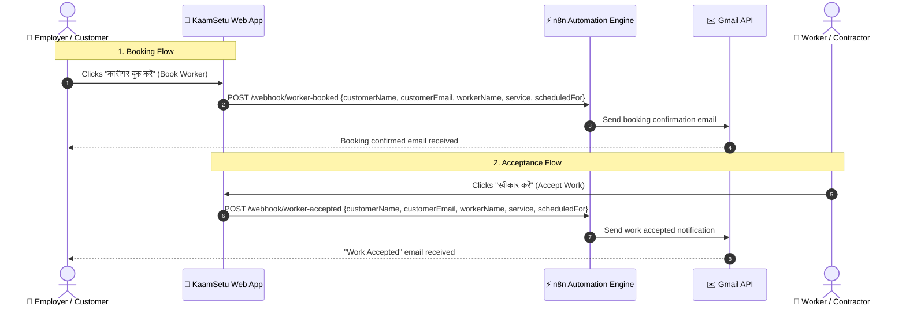

# 🌉 KaamSetu (कामसेतु) — Digital Bridge for Informal & Daily-Wage Workers

[](LICENSE)
[](https://vitejs.dev/)
[](https://react.dev/)
[](https://supabase.com/)
[](https://elevenlabs.io/)
[](https://n8n.io/)

> **KaamSetu** is a Hindi-first, mobile-optimized digital platform designed to bring wage transparency, rapid hiring, automated communication, and multilingual voice AI assistance to India's informal blue-collar workforce, daily-wage artisans, contractors, and household employers.

---

## 📌 Repository Description (for GitHub)

```text
KaamSetu (कामसेतु) — A Hindi-first wage-transparency, hiring, and workflow automation platform for daily-wage workers, contractors, and employers. Features 1-tap booking, n8n email automation, Supabase cloud sync, and an ElevenLabs conversational voice AI companion.
```

**Topics / Tags:**  
`react`, `vite`, `supabase`, `n8n`, `elevenlabs`, `voice-ai`, `blue-collar`, `wage-transparency`, `hindi-first`, `mobile-first`, `informal-economy`

---

## 🌟 Key Features & Innovations

- **Tri-Persona Ecosystem**: Seamless tailored interfaces for **Workers (कुशल मज़दूर)**, **Employers / Homeowners (नियोक्ता / घर मालिक)**, and **Contractors (ठेकेदार / कंस्ट्रक्टर)**.
- **Multilingual & Voice-First (Hindi / English)**: Designed specifically for low-literacy users with high-contrast visual cues, large icons, Hindi audio-first paradigms, and bilingual switching.
- **AI साथी / ElevenLabs Conversational Voice Agent**: Integrated multilingual voice bot with a custom frosted glass interface (`backdrop-filter: blur`) and auto-minimizing behavior upon call completion.
- **Fair Wage Benchmark Intelligence**: Automatic visual price sanity indicator (**कम** / Below Avg, **उचित** / Fair Wage, **ज़्यादा** / Above Avg) benchmarked against live city wage trends.
- **Instant Webhook Automations (n8n + Gmail)**: Real-time transactional email notifications sent to customers when a worker is booked or when a worker/contractor accepts work.
- **Resilient Hybrid Data Layer**: Real-time cloud persistence via **Supabase PostgreSQL** paired with instant local storage fallbacks for zero-downtime offline demonstrations.
- **Horizontal Category Filter Scroller**: Smooth left-to-right swipe, mouse drag, mouse wheel horizontal conversion, and arrow controls for trade categories (Masonry, Painting, Plumbing, Carpentry, Electrician, Welder, Helper).
- **Universal Mobile-First Shell**: Pixel-perfect responsive mobile experience framed with an iPhone dynamic status bar on desktop and true full-screen responsive rendering on mobile devices.

---

## 🛠️ Technology Stack

| Layer | Technologies Used |
| :--- | :--- |
| **Frontend Framework** | React 19, JavaScript (ESNext), JSX |
| **Build Tool & Bundler** | Vite 8.3 |
| **Styling & Design System** | Pure Vanilla CSS3 (Custom Design Tokens, Glassmorphism, CSS Grid & Flexbox) |
| **Icons** | Lucide React |
| **Voice AI & Speech** | ElevenLabs Conversational AI Web SDK (`elevenlabs-convai`) |
| **Workflow Automation** | n8n Cloud Webhook Engine + Google Workspace / Gmail API |
| **Database & Auth** | Supabase (PostgreSQL, Row Level Security, Google OAuth, Phone OTP Auth) |
| **Testing & Verification** | Playwright Chromium Headless Test Suite, ESLint |

---

## 📁 Project Architecture & Directory Structure

```text
KaamSetu/
├── dist/                          # Production build output
├── public/                        # Static assets (logos, favicon)
├── server/
│   └── schema.sql                 # Supabase PostgreSQL schema with RLS policies
├── src/
│   ├── assets/                    # Project branding and images
│   ├── components/                # Modular UI components
│   ├── data/                      # Initial seed data for workers, jobs, trades
│   ├── services/                  # Supabase synchronization and API adapters
│   ├── App.css                    # Unified mobile-first styling & design tokens
│   ├── App.jsx                    # Primary application routing & views
│   ├── index.css                  # Base typography and reset rules
│   ├── main.jsx                   # React entrypoint
│   ├── supabaseClient.js          # Supabase client instantiation & config checks
│   └── translations.js            # Bilingual dictionaries (Hindi / English)
├── .env.example                   # Environment configuration template (NO SECRETS)
├── .gitignore                     # Git exclusion rules (.env, node_modules, etc.)
├── package.json                   # Dependencies and npm scripts
├── vite.config.js                 # Vite development and build configuration
└── README.md                      # Project documentation
```

---

## 🚀 Getting Started & Local Setup

### Prerequisites
- [Node.js](https://nodejs.org/) (version 18.0.0 or higher recommended)
- [npm](https://www.npmjs.com/) (version 9.0.0 or higher)
- Modern web browser (Chrome, Edge, Firefox, or Safari)

### 1. Clone the Repository
```bash
git clone https://github.com/YOUR_USERNAME/KaamSetu.git
cd KaamSetu
```

### 2. Install Dependencies
```bash
npm install
```

### 3. Environment Configuration
Create a `.env` file from the provided `.env.example` template:
```bash
cp .env.example .env
```

Open `.env` in your text editor and fill in your Supabase credentials (optional for local demo mode; the app works seamlessly out of the box with offline mock fallbacks):

```env
# Supabase Configuration
VITE_SUPABASE_URL=https://your-project-id.supabase.co
VITE_SUPABASE_ANON_KEY=your-anon-public-key
```

> [!CAUTION]
> **SECURITY WARNING**: Never commit `.env` or any sensitive API keys, service role keys, or database credentials to GitHub. The repository includes `.env*` in `.gitignore` by default.

### 4. Run the Development Server
```bash
npm run dev
```
Open your browser and navigate to `http://localhost:5173`.

### 5. Build for Production
To create an optimized production bundle:
```bash
npm run build
```
Preview the production build locally:
```bash
npm run preview
```

---

## 📖 Step-by-Step Usage Guide

### Step 1: Launch & Select Your Role
1. Open the app in your browser or on mobile.
2. The welcome screen introduces the 3 primary roles:
   - **मज़दूर (I need work / Worker)**: For artisans, helpers, painters, plumbers looking for daily jobs.
   - **ठेकेदार (Contractor)**: For sub-contractors managing construction crews and posting site requirements.
   - **मालिक (I need workers / Employer)**: For house owners, project managers, and builders looking to hire verified workers.
3. Use the **English / हिंदी** toggle in the top-right header at any time to switch languages.

---

### Step 2: Authentication (Demo Mode & Google Login)
- **Phone Login**: Enter any 10-digit phone number and tap **"ओटीपी भेजें" (Send OTP)**.
  - In demo/development mode, the default verification code is **`123456`**.
- **Google 1-Tap Login**: Tap **"Google से जारी रखें" (Continue with Google)**. If already authenticated, the app bypasses phone prompts and immediately opens your dashboard.

---

### Step 3: Worker Flow ("काम चाहिए")
1. **Browse Available Jobs**:
   - View daily-wage listings in your area with pay rates (₹/day), shift timings, and location.
   - View fair wage indicators (**उचित** / Fair Wage, **कम** / Below Avg).
2. **Filter by Trade**:
   - Use the horizontal **Category Scroller** to navigate categories:
     - **राजमिस्त्री (Masonry)**
     - **पेंटर (Painting)**
     - **प्लंबर (Plumbing)**
     - **बढ़ई (Carpentry)**
     - **इलेक्ट्रीशियन (Electrician)**
     - **वेल्डर (Welding)**
     - **सहायक / लेबर (Helper / Laborer)**
   - Click the left (`‹`) or right (`›`) arrows, or drag horizontally on desktop/mobile.
3. **1-Tap Job Application**:
   - Tap **"विवरण देखें व आवेदन करें" (View Details & Apply)**.
   - Tap **"काम के लिए आवेदन करें" (Apply for Job)**.
   - The job is instantly added to your **"मेरे काम" (Applied Jobs)** tab.
4. **Reviews & Rating**:
   - Inspect verified customer reviews and star ratings on your profile without distracting earnings clutter.

---

### Step 4: Employer Flow ("मज़दूर चाहिए")
1. **Browse Verified Workers**:
   - Explore the searchable workers directory displaying experience, spoken languages, daily rates, and special skill tags.
   - Filter workers by trade using the horizontal scroller.
2. **1-Tap Worker Booking with Automated Email**:
   - Tap **"कारीगर बुक करें" (Book Worker)**.
   - An automated POST webhook is dispatched to `https://aframmm.app.n8n.cloud/webhook/worker-booked`.
   - The customer receives an instant confirmation email via Gmail with the booking details, scheduled date, and worker details.
3. **Post a New Job Listing**:
   - Tap the **"काम लगाएँ" (Post Job)** bottom tab.
   - Select the required trade, title, location, number of workers, daily pay rate, and **काम शुरू होने की तारीख (Work Start Date)**.
   - Once posted, the job is immediately visible under the live available jobs feed.

---

### Step 5: Contractor Flow ("ठेकेदार / कंस्ट्रक्टर")
1. **Post Multi-Worker Site Demands**:
   - Create large crew requests (e.g. 5 Masons, 3 Helpers) with specific start dates.
2. **Accept or Deny Applications**:
   - View incoming applications from workers in the **"आवेदन" (Applications)** tab.
   - Tap **"स्वीकार करें" (Accept Work)** to confirm an application.
   - Automatically triggers the worker-accepted webhook `https://aframmm.app.n8n.cloud/webhook/worker-accepted`, delivering an automated confirmation email to the employer/customer.
3. **Manage Crew**:
   - View your active on-site workers in the **"मेरी टोली" (Crew)** tab.

---

### Step 6: Using the ElevenLabs Voice AI Assistant ("AI साथी")
1. Located in the lower portion of the screen, tap the floating black pill: **`📞 AI साथी / Talk to AI`**.
2. The widget smoothly expands into a modern **frosted glass modal** with background blur.
3. Tap **"Start a call"** and speak naturally in **Hindi** or **English**.
   - Ask about market wage benchmarks (e.g. *"What is the fair wage for a painter in Mumbai?"*).
   - Ask about hiring verified workers or finding construction jobs.
4. Tap **End Call** or the top-right **✕ (Close)** button.
5. The widget **automatically minimizes** back into its unobtrusive floating pill button.

---

## ⚙️ Workflow Automation & Webhook Integration

KaamSetu integrates with **n8n Cloud** and **Gmail API** to deliver automated transactional emails:



---

## 🔒 Security Best Practices

- **Zero Committed Secrets**: `.env` and sensitive API keys are strictly excluded via `.gitignore`.
- **Row Level Security (RLS)**: PostgreSQL tables in `server/schema.sql` include policies restricting access based on user session authentication.
- **Client-Side Sanitization**: Input fields for phone numbers, rates, and job details are sanitized prior to state mutations and database insertion.

---

## 👥 Authors & Acknowledgments

- Built with ❤️ for India's hardworking artisans and daily-wage workforce.
- Voice AI powered by [ElevenLabs](https://elevenlabs.io/).
- Workflow automation powered by [n8n](https://n8n.io/).
